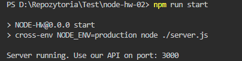

# Node.JS Homework 6 (Working with email and docker)

This task adds automatic emailing of the veryifying account link as well as re-sending of the email in case something happens to the previous one. The MailGun platform was used to perform the tas.

---

## How to install

Clone this repo to your desktop and run `npm install` to install all the dependencies.

Rename file `.env-sample` to `.env`

#### Remember never to share passwords

You might want to look into `.env` to make change the port you want to use.

You need to create an account on the MailGun website and then fill in the .env data such as password and name

After you clone this repo to your desktop, go to its root directory and run `npm install` to install its dependencies.

Once the dependencies are installed, you can run `npm run start` to start the application. You will then be able to access it at localhost:3000


```shell
npm run start
```
---
## Usage

GET - http://localhost:3000/users/verify/:verificationToken - During registration, a verification token is created which is sent to the specified email address. After entering it, the token is removed from the database and takes the status verify: true.

POST - http://localhost:3000/users/verify - using Postman send email in body to verify if email exist and is verified. If it is not the email with the activation link will be sent again.


